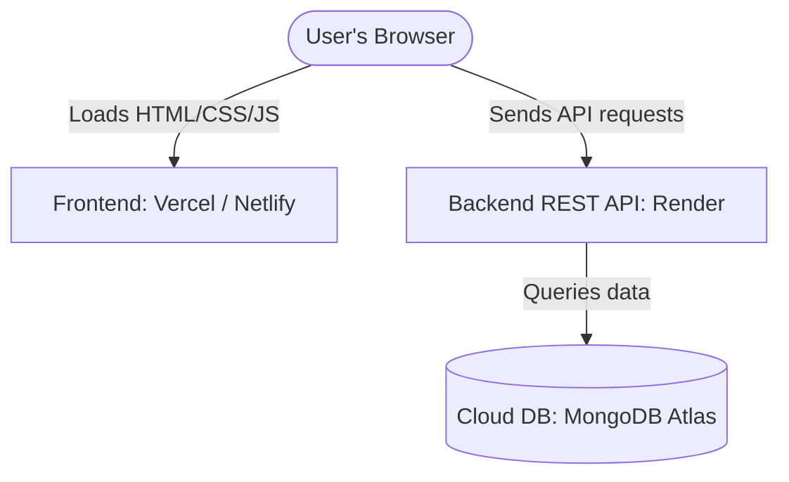

# Placement Portal Deployment Guide

This guide provides step-by-step instructions for deploying the **Placement Portal** to a production environment using **separate hosting** (Frontend on Vercel/Netlify, Backend on Render, and Database on MongoDB Atlas).

---

## Architecture Overview



---

## Step 1: Set Up MongoDB Atlas (Cloud Database)

1. **Create an Account:**
   Go to [MongoDB Atlas](https://www.mongodb.com/cloud/atlas) and sign up for a free account.
2. **Build a Database Cluster:**
   - Create a new project.
   - Deploy a free-tier M0 Cluster. Choose your preferred cloud provider (AWS/GCP) and region closest to you.
3. **Database Access Security:**
   - Under **Database Access**, create a database user (e.g., `db_user`).
   - Assign the user the **Read and write to any database** privilege.
   - Choose a secure password and note it down.
4. **Network Access Security (IP Access List):**
   - Under **Network Access**, click **Add IP Address**.
   - Select **Allow Access From Anywhere** (`0.0.0.0/0`).
     *Note: Since Render web service IPs rotate dynamically, allowing access from anywhere is required for connection.*
5. **Get Connection String:**
   - Go to the **Clusters** page.
   - Click **Connect** -> **Drivers**.
   - Copy the connection string. It will look like:
     `mongodb+srv://<username>:<password>@cluster0.xxxx.mongodb.net/?retryWrites=true&w=majority&appName=Cluster0`
   - Replace `<password>` with the password you created for the database user.

---

## Step 2: Deploy the Backend API to Render

1. **Prepare Repository:**
   Ensure your project codebase is pushed to a GitHub repository.
2. **Create Web Service on Render:**
   - Log in to [Render](https://render.com/).
   - Click **New +** -> **Web Service**.
   - Connect your GitHub account and select your project repository.
3. **Configure Build and Start Settings:**
   - **Name:** `placement-portal-api` (or any unique name).
   - **Region:** Select the region closest to your users.
   - **Root Directory:** `backend` (Important: Set to `backend` as that is where `package.json` resides).
   - **Runtime:** `Node`.
   - **Build Command:** `npm install` (or `npm ci`).
   - **Start Command:** `node server.js` (or `npm start`).
   - **Instance Type:** `Free`.
4. **Configure Environment Variables:**
   Click the **Environment** tab and add the following keys:
   - `NODE_ENV` = `production`
   - `MONGO_URI` = *[Your MongoDB Atlas connection string from Step 1]*
   - `JWT_SECRET` = *[A long, secure, randomly generated secret key]*
   - `CLIENT_URL` = *[Your deployed Frontend URL (e.g. https://your-app.vercel.app)]*
     *(Note: If you don't have the Vercel URL yet, you can configure this after deploying the frontend).*
5. **Deploy:**
   Click **Create Web Service**. Wait for the logs to say `Server Running on Port ...` and `MongoDB Connected`.
6. **Copy Web Service URL:**
   - Copy the deployed backend URL from the top of the Render dashboard page (e.g., `https://placement-portal-api.onrender.com`).

---

## Step 3: Configure Frontend API Endpoint

Before deploying the frontend, we must configure it to point to your new live backend Render URL instead of `localhost`.

1. Open the file [frontend/js/config.js](file:///c:/Users/RAVIKUMAR%20PASWAN/OneDrive/Desktop/Placement-Portal/frontend/js/config.js).
2. Locate the line containing:
   `const API_BASE_URL = ...`
3. Update the production fallback URL with your actual Render URL:
   ```javascript
   const API_BASE_URL = window.location.hostname === "localhost" || window.location.hostname === "127.0.0.1"
     ? "http://localhost:5000"
     : "https://placement-portal-api.onrender.com"; // <-- Put your Render URL here!
   ```
4. Save the changes.
5. Commit and push the changes to your GitHub repository:
   ```bash
   git add frontend/js/config.js
   git commit -m "Configure production backend URL"
   git push origin main
   ```

---

## Step 4: Deploy the Frontend to Vercel or Netlify

### Option A: Deploying on Vercel (Recommended)
1. Log in to [Vercel](https://vercel.com/).
2. Click **Add New** -> **Project**.
3. Select your GitHub repository.
4. **Configure Project:**
   - **Framework Preset:** `Other` (or keep default as it is static HTML).
   - **Root Directory:** `frontend` (Important: Set to `frontend` so only static frontend files are served by Vercel).
5. **Deploy:**
   Click **Deploy**. Once finished, Vercel will give you a live production URL (e.g., `https://placement-portal-frontend.vercel.app`).
6. **Update Backend CORS Configuration:**
   Go back to your **Render Dashboard**, select your web service, navigate to the **Environment** tab, and update the `CLIENT_URL` variable to your Vercel URL. Render will automatically redeploy the backend with the updated CORS rule.

### Option B: Deploying on Netlify
1. Log in to [Netlify](https://www.netlify.com/).
2. Click **Add new site** -> **Import from Git**.
3. Connect your GitHub repository.
4. **Configure Build Settings:**
   - **Base directory:** `frontend`
   - **Build command:** *[Leave empty]*
   - **Publish directory:** `.`
5. Click **Deploy Site**.
6. Copy your site domain name and update the `CLIENT_URL` environment variable on your Render Web Service.

---

## Step 5: Post-Deployment Verification

### 1. Smoke Testing (Browser)
- Open your live Frontend URL in the browser.
- Verify that **Portal Statistics** load correctly on the landing page (this checks that the public `/api/dashboard/stats` route is accessible).
- Register a new Student or Company account (using a real email address).
- Log in and verify that the page correctly redirects you to the appropriate dashboard.

### 2. API Testing (Postman)
- Open your Postman application.
- Select your **Placement Portal Collection**.
- Edit the collection variables to change `baseUrl` from `http://localhost:5000` to your Render API URL (e.g., `https://placement-portal-api.onrender.com`).
- Run registration, login, and dashboard requests to ensure they resolve with a `200 OK` or `201 Created` status code.
